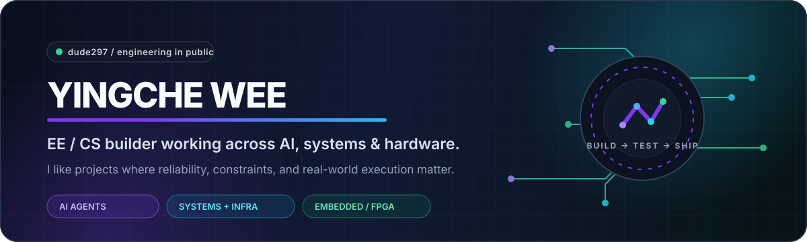

  

  <a href="https://dude297.github.io/dude297/"><b>Portfolio</b></a>
  &nbsp;·&nbsp;
  <a href="https://dude297.github.io/dude297/resume.html"><b>Résumé</b></a>
  &nbsp;·&nbsp;
  <a href="https://github.com/dude297?tab=repositories"><b>Projects</b></a>
  &nbsp;·&nbsp;
  <a href="https://github.com/dude297"><b>GitHub</b></a>

  <b>I build systems that have to work outside the demo.</b> 
  AI agents · distributed systems · local infrastructure · embedded Linux · FPGA / electronics

 

## Selected builds

<table>
<tr>
<td width="50%" valign="top">

### 01 — Converge
**Durable outcomes for AI agents.**

Agents choose the desired outcome; Converge persists it, observes authoritative systems, and deterministically repairs only the remaining safe drift.

<code>Gemini</code> <code>Supabase</code> <code>Stripe</code> <code>Next.js</code> <code>Vercel</code>

<a href="https://dude297.github.io/dude297/projects/converge.html"><b>Case study →</b></a>
&nbsp;·&nbsp;
<a href="https://scholarsafe.vercel.app/demo"><b>Live demo ↗</b></a>

</td>
<td width="50%" valign="top">

### 02 — ColleAgent
**Private planning. Public research. Minimum disclosure.**

A privacy-first academic planning system that keeps transcript/GPA/scheduling context campus-side while public agents receive only the evidence needed for research.

<code>Next.js</code> <code>FastAPI</code> <code>SQLite</code> <code>Agents</code> <code>Privacy</code>

<a href="https://dude297.github.io/dude297/projects/colleagent.html"><b>Case study →</b></a>

</td>
</tr>

<tr>
<td width="50%" valign="top">

### 03 — HomeHub
**Local-first distributed infrastructure.**

A home-compute stack with durable state, bounded execution, release authority, recovery, local services, Raspberry Pi edge nodes, and private automation.

<code>Python</code> <code>Linux</code> <code>SQLite</code> <code>Raspberry Pi</code> <code>Tailscale</code>

<a href="https://dude297.github.io/dude297/projects/homehub.html"><b>Case study →</b></a>

</td>
<td width="50%" valign="top">

### 04 — After the Shield
**Causal VLA safety research.**

Studying whether a runtime safety intervention changes a vision-language-action policy's next nominal proposal using paired counterfactual simulator branches.

<code>Python</code> <code>Jupyter</code> <code>π₀.₅-LIBERO</code> <code>SafeLIBERO</code> <code>Causal design</code>

<a href="https://dude297.github.io/dude297/projects/after-the-shield.html"><b>Case study →</b></a>

</td>
</tr>
</table>

 

## 🧰 Toolbox

  

  
  
  
  
  
  

 

## 🚀 Public work

<table>
<tr>
<td width="50%" valign="top">

**Apple Dynamic Desktop → KDE Plasma.** Preserves embedded HEIC schedules or aligns frames to local solar time.

</td>
<td width="50%" valign="top">

**A production-minded personal opportunity engine.** Eligibility, deterministic fit scoring, verified sources, application tracking, and deployment at $0/month.

</td>
</tr>
</table>

### 🖥️ Plasma Dynamic Wallpaper in action

  

 

## 📊 GitHub signal

  
  

> A lot of my larger current work lives in private repositories while it is under active development. A daily profile workflow also generates private-inclusive local stats without exposing private code.

 

## 🔬 How I like to build

<table>
<tr>
<td align="center" width="25%"><b>01</b> Model the constraint</td>
<td align="center" width="25%"><b>02</b> Build the smallest real system</td>
<td align="center" width="25%"><b>03</b> Attack the failure modes</td>
<td align="center" width="25%"><b>04</b> Ship + observe</td>
</tr>
</table>

 

<b>More things I work on</b>

 

- 🤖 AI agent reliability, tool use, reconciliation, and governance
- 🧠 ML / VLA research and reproducible experimentation
- 🐧 Linux automation and local-first infrastructure
- 🍓 Raspberry Pi systems and embedded interfaces
- ⚡ Circuits, electronics, FPGA / Verilog, and hardware-software integration
- 🌐 Full-stack products with security, CI, tests, and real deployments

 

  <b>software ↔ systems ↔ hardware</b>

